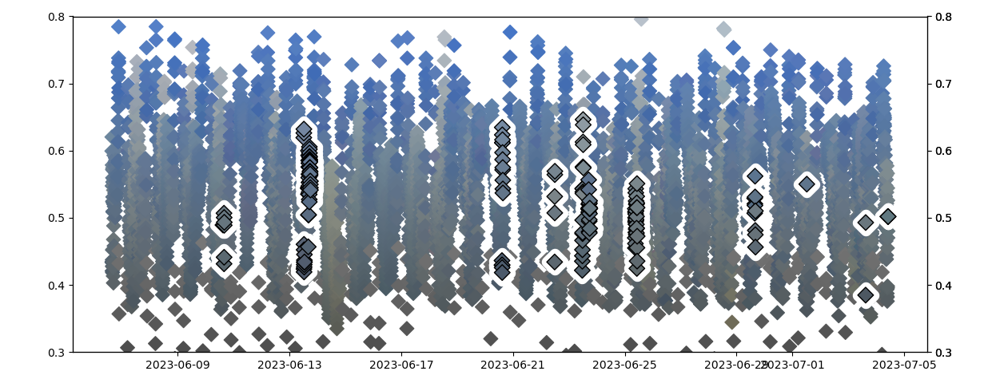
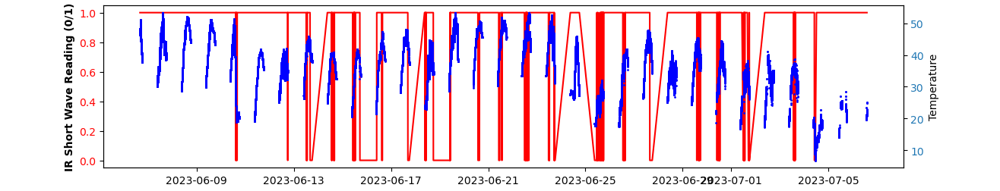
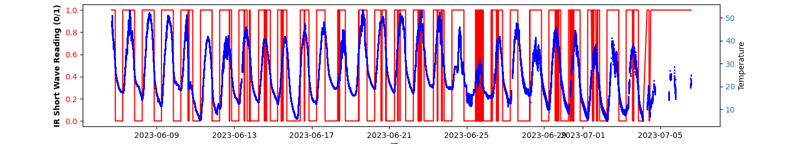
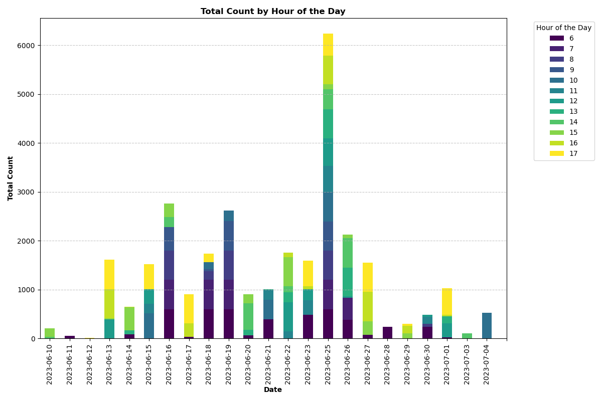
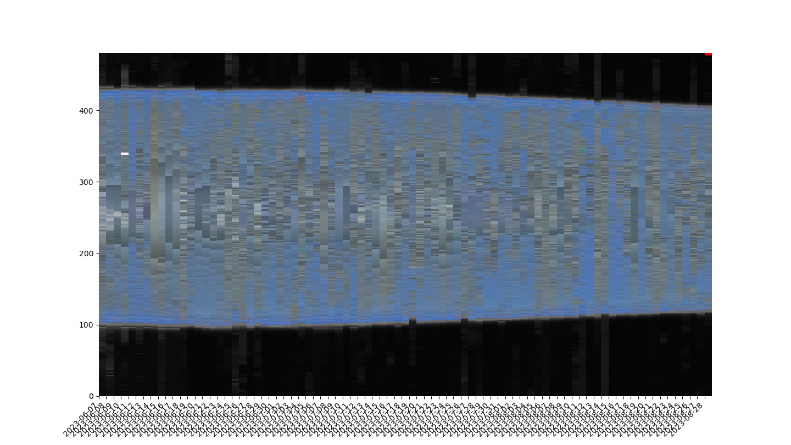
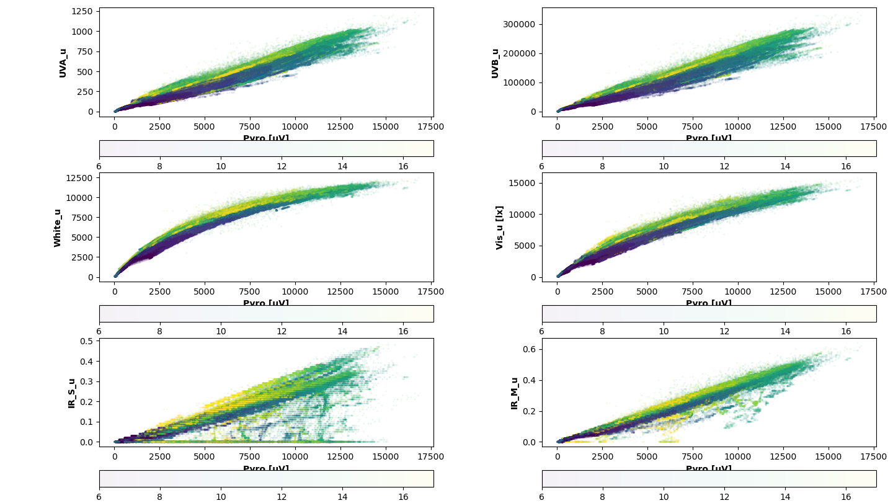
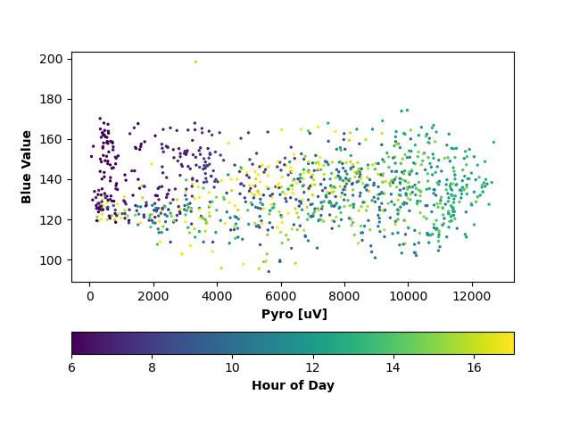

# Monarch Solar Radiation
~ an on-going research project~

---
**Last updated:** 
2024-10-03

This graphs show the RGB value of the zero readings from IR_s sensor. The scatter with black edge are the zero readings. There is no correlation between the IR shortwave reading with the rainy/cloudy conditions, it did catch some zeros from the huge rain storm on the 10 of June in 2023 but other zero readings from checking the camera photos did not support that arguement. 

The station has been setup and currently running on top of SAFL. It will be running for a couple of days. The goal is to check if the same error reproduced in this new run.

This graph shows a better pattern for the IR Short thru Time and Temperature thru Time.

It seems to me that if the Temperature drop bellow 20 C probably at night and early morning then the sensors pick up as 0 but that pattern works only for the first couple of days.

Here is the graph after I only include the data between hour 9 to 17 which does reduced the number of 0 reading from IR Shortwave.

I was wondering if the the zeros from IR short wave frequently around a specific time of the day but turn out after I bin them into hours and bar graph all of the zeros with high Pyrometer values, the patterns tells me it happened a lot around the early hours and interestingly the whole day of 25 of June. I checked the photos of the sky it looks blue and with normal clouds. Still don't know why, perhaps this is due to hardware issue?

*Figure 1: Sky BRG Signature between the 7 June to 28 August*

Interesting finding: between the 14 and 16 of June, I checked with the past weather and they reported those days to have a lot of smoke in the air.
We can also see the day light getting shorter approaching August.

*Figure 2: Sensors data v Pyro between the hour 6 to hour 17*

Converted UTC to Central Time and only select data between 6 AM and 5 PM
Data is filtered to remove error data which usually occur by hardware or during night time. Still need to check on why short wavelength of IR caused the staircase patterns.

*Figure 3: Blue value vs Pyro between the 7 to 30*

I averaged the Pyro data and the Blue value data with mean of interval of 15 mins (only able to look into the data between the 7 of June to 30 of June, my computer is still processing for the month of July)

---

Using Arduino IDE version 1.8.9 and libraries found here: https://github.com/NorthernWidget/NorthernWidget-libraries
