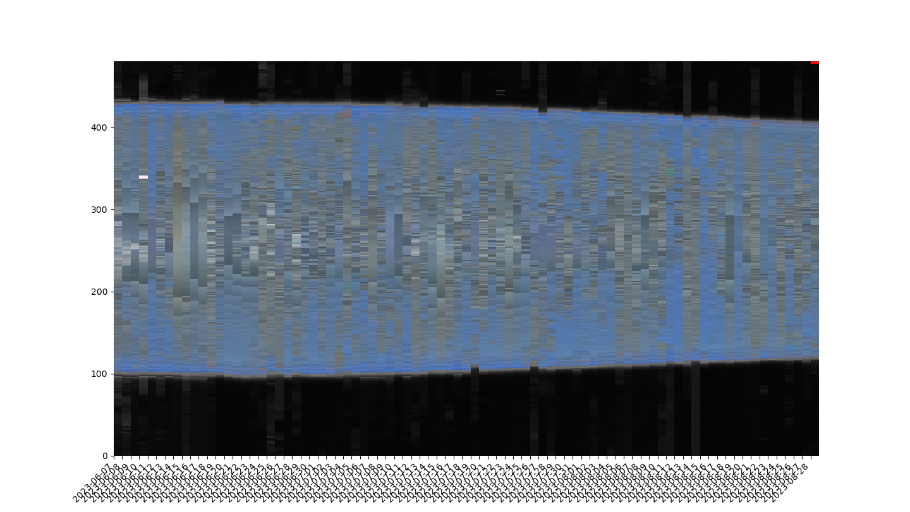
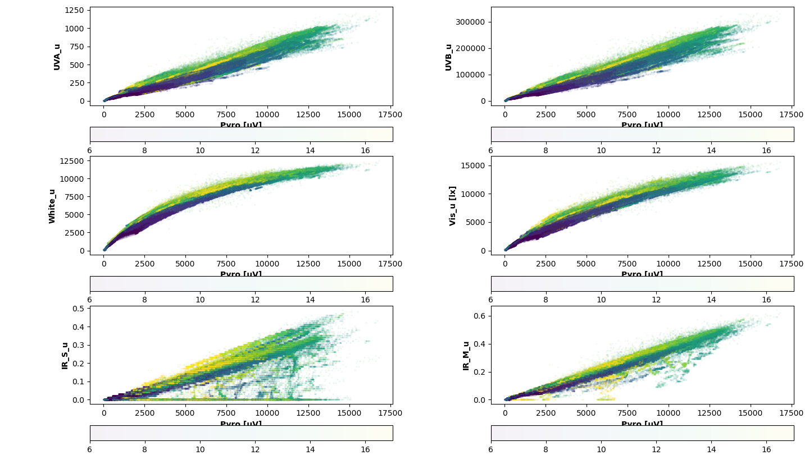
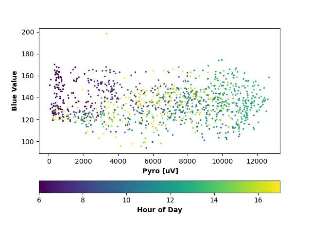

# Monarch Solar Radiation
~ an on-going research project~

---
**Last updated:** 2023-10-05 17:30:00

*Figure 1: Sky BRG Signature between the 7 June to 28 August*

Interesting finding: between the 14 and 16 of June, I checked with the past weather and they reported those days to have a lot of smoke in the air.
We can also see the day light getting shorter approaching August.

*Figure 2: Sensors data v Pyro between the hour 6 to hour 17*

Converted UTC to Central Time and only select data between 6 AM and 5 PM
Data is filtered to remove error data which usually occur by hardware or during night time. Still need to check on why short wavelength of IR caused the staircase patterns.

*Figure 3: Blue value vs Pyro between the 7 to 30*

I averaged the Pyro data and the Blue value data with mean of interval of 15 mins (only able to look into the data between the 7 of June to 30 of June, my computer is still processing for the month of July)

---

Using Arduino IDE version 1.8.9 and libraries found here: https://github.com/NorthernWidget/NorthernWidget-libraries
